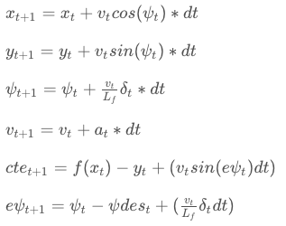

# CarND-Controls-MPC
Below is a description of my submission for the MPC project.

## Highlights of my submission
1. Reaches a top speed of 90mph.
2. Could reach a top speed of 100mph while staying on the track and looping continuously (however, it may get a little close to comfort to the ledge/curb).
3. Accounts for latency in an intelligent manner in both the MPC and the preprocessing.

## The Model
The state consists of the vehicle's x and y coordinates, its current velocity, the bearing angle apart from cross track error (CTE) and psi error. The latter two are derived quantities. The outputs of the MPC are the acceleration and steering angle. The model considers the previous state and obtains the current state by adjusting for each state variable's update in the time that has passed.



Which when realized in code was modified to:
```
fg[1 + x_start + t] = x1 - (x0 + v0 * CppAD::cos(psi0) * dt);
fg[1 + y_start + t] = y1 - (y0 + v0 * CppAD::sin(psi0) * dt);
fg[1 + psi_start + t] = psi1 - (psi0 - v0 * delta0 / Lf * dt);
fg[1 + v_start + t] = v1 - (v0 + a0 * dt);
fg[1 + cte_start + t] = cte1 - ((f0 - y0) + (v0 * CppAD::sin(epsi0) * dt));
fg[1 + epsi_start + t] = epsi1 - ((psi0 - psides0) - v0 * delta0 / Lf * dt);
```
 
## Timestep length and Elapsed Duration (N & dt)
After experimenting with the values given in the example lessons of N = 25 and t=0.05 and slowly stepping down the N and stepping up the t, I settled finally with N=10 and t=0.1. t=0.1 also neatly aligned with the latency of 100ms, requiring processing of just the previous timestep in the estimation of the delta and acceleration. 

## Polynomial Fitting and MPC Preprocessing
For fitting the polynomial, I modified the polynomial by transforming it into the vehicle's frame of reference. The modified values of px, py and psi became zero and the xvals and yvals were transformed to the new frame of reference as follows:

```
px_ = 0.0
py_ = 0.0
psi_ = 0.0
ptsx_ = (x - px) * cos(psi_ - psi) - (y - py) * sin(psi_ - psi)
ptsy_ = (x - px) * sin(psi_ - psi) + (y - py) * cos(psi_ - psi)
```

This simplified the processing, but more importantly, this was what ensured that the delta and acceleration values were correct enough for the model to work properly.

## Model Predictive Control with Latency
The elapsed duration helped me in modifying the state supplied to the MPC controller. The following were the changes made to the state are as follows:
```
double px_current   = px_ + v * dt;
double py_current   = py_ + 0 * dt;
double psi_current  = psi_ + v * (-delta) / Lf * dt;
double v_current    = v + a * dt;
double cte_current  = cte + v * sin(epsi) * dt; // Accounting for latency
double epsi_current = epsi + v * (-delta) / Lf * dt;
```
